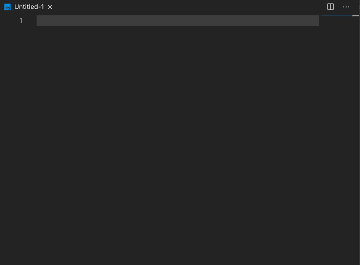

# fp-ts-snippets README

A set of snippets to help with writing fp-ts code.

## Features

| snippet | expanded |
|--|--|
| `fpt`    | `import * as T from "fp-ts/Task";`            |
| `fpe`    | `import * as E from "fp-ts/Either";`            |
| `fpte`     | `import * as TE from "fp-ts/TaskEither";`     |
| `fpo`     | `import * as O from "fp-ts/Option";`          |
| `fpa`     | `import * as A from "fp-ts/Array";`           |
| `fpfn`   | `import { _ } from "fp-ts/function";`         |
| `fpp`    | `import { pipe } from "fp-ts/function";`      |
| `fpf`    | `import { flow } from "fp-ts/function";`      |
| `fpio`     | `import * as IO from "fp-ts/IO"`              |
| `fpioe`    | `import * as IOE from "fp-ts/IOEither"`       |
| `fpfold`   | `{E, TE, O, IOE}.fold(leftSideFn, rightSideFn)`  |
| `fptryc`   | `{E, TE, O, IOE}.tryCatch(tryFn, onError)`       |
| `fpred` | `{E, TE, O, IOE}.reduce(initialValue, reducer)`  |

## Requirements

- These snippets will only work in a typescript file.

## Extension Settings

N/A

## Known Issues

Very much a first draft of useful snippets. More will come with more usage of fp-ts.

## Release Notes

### 2.1.1
- add `fpe` snippet to import Either
